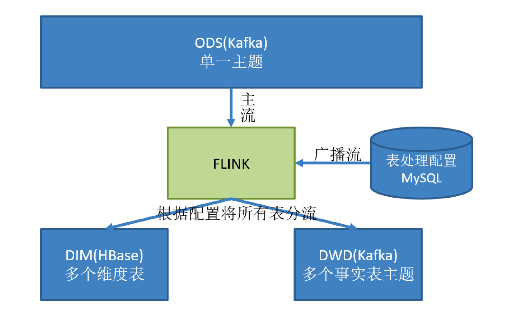

# Flink实时数仓项目笔记

> Flnk实时项目

# 1.采集模块

## 1.1数仓分层

### 1.1.1 数仓为什么要分层

> 复用

1. 普通实时计算优**先考虑时效性**，所以从数据源采集经过实时计算直接得到结果，时效性好。 但是弊端是由于计算过程中的中间结果没有沉淀下来，所以当面对大量实时需求时，计算的复用性差，开发成本随着需求增加而直线上升

   

2. 实时数仓基于一定的数仓理念，对数处理流程进行**规划，分层**，目的就是为了数据的**复用性**。

   

### 1.1.2 如何分层

#### 1.1.1.2 层

1. ODS：原始数据，日志和业务数据
2. DWD：根据数据对象为单位进行分流，比如订单数据，页面访问等  -- kafka
3. DIM：维度数据 -- HBase，phonix
4. DWM：对于部分数据对象进行进一步加工，比如独立访问，跳出行为，也可以和维度进行关联，形成宽表，依旧是明细数据
5. DWS：根据某个主题（维度）将多个事实数据轻度聚合， 形成主题宽表 -- clickhouse
6. ADS：把clickhouse中的数据根据可视化的需求进行筛选聚合  -- 不落盘， 实时接口


## 1.2 整体需求介绍

### 1.2.1 查询的分类

1. 离线查询：需求固定性，每天执行

2. 实时查询：需求固定性，7X24小时执行

3. 即席查询：需求的临时性，临时一次的数据需求，不需要维护。

   - Presto：当场计算（基于内存速度快）

   - kylin：预计算（提前算好），多维度分析（Hive With Cube）
     - sex dept addr => 2的n次方种
       - 0-dim 1
       - 1-dim 3
       - 2-dim 3
       - 3-dim 1

### 1.2.2 实时需求的种类

1. 日常统计报表或分析图中需要包含当日部分
2. 实时数据大屏监控
   - 离线和实时兼并
3. 数据预警提示
   - 只做实时不做离线
4. 实时推荐系统

## 1.3 统计架构分析

### 1.3.1 离线架构


#### 1.3.1.1 Sqoop导入数据的方式：

1. 全量：where 1=1 
2. 增量：where 创建时间=当天
3. 新增及变化：where 创建时间=当天 or 更新时间=当天
4. 特殊：只导入一次

#### 1.3.1.2 Flume：

1. TailDirSource
   - 优点：断点续传，监控多目录多文件，实时监控
   - 缺点：当文件更名之后会重新读取该文件造成重复
   - 注意：
     1. 要使用不更名打印日志框架（logback）
     1. 修改源码， 让TailDirSource判断文件时只看iNode的值
2. KafkaChannel：
   - 优点：将数据写入kafka，省了一层Sink
   - kafka：生产者，消费者
   - 用法：
     1. source - KafkaChannel - sink
     1. source - KafkaChannel
     1. KafkaChannel - sink
3. 逻辑线：数据流，监控，优化，配置


#### 1.3.1.3 Kafka：

1. Producer：

   - ACK 0  （如何保证生产者不丢数据）
   - 拦截器，序列化器，分区器
   - 发送流程 sender main
   - 幂等性， 事务
   - 分区规则 --> 
     1. 有指定分区则发往指定分区
     2. 没有指定分区，则根据key值hash
     3. 没有指定区分也没有key的时候，轮询（粘性）

2. Broker

   - Topic:
     1. 副本：高可靠
     2. 分区：高并发，负载均衡（防止热点）
     3. 

3. Consumer

   - 分区分配规则

   - offset保存

     1. 默认：__consumer_offsets主题

     2. 其他：手动维护offset（Mysql）， 将保存数据和保存offset写到一个事务，精准一次性

        - 如果不写在同一个事务

          1. 先写数据， 再保存offset： 重复数据+下游幂等性（精准一次消费）

          2. 先写offset， 再写数据：数据可能丢失。

4. 优化，监控，配置，数据量，峰值速度


### 1.3.2 实时架构


### 1.3.3 架构对比

#### 1.3.3.1 离线架构

- 优点：耦合性低，稳定性高
- 缺点：时效性差一点
- 说明：
  1. 项目经理（架构师）决定，更追求稳定性
  2. 耦合性低，稳定性高
  3. 考虑到公司的发展，数据量一定会增长很大
  4. 早期的时候实时业务使用sparkstreming处理（微批次）

#### 1.3.3.2 实时架构

- 优点：时效性高
- 缺点：耦合性高，稳定性低
- 说明：
  1. 时效好
  2. kafka集群高可用，挂一台两台是没有问题
  3. 数据量小，所有机器存在同一个机房，传输没问题
  4. 架构师决定实时业务使用的是Flink


## 1.4 日志数据采集

### 1.4.1 SpringBoot：

 1. Controller：拦截用户请求，调用service，相应请求

 2. Service：调用DAO，加工数据

 3. DAO（Mapper）：获取数据（SQL）

 4. 持久化层：存储数据


## 1.5 Flink CDC

### 1.5.1 mysql开启binlog

### 1.5.2 使用 dataStream 实现 Flink CDC

#### 1.5.2.1 自定义反序列化器

#### 1.5.2.2 优点

1. 监控多库多表

#### 1.5.2.3 缺点

1. 需要自己实现反序列化器格式化获取到的数据（同时也可以认为是灵活）

### 1.5.3 使用 Flink SQL 实现Flink CDC

#### 1.5.3.1 优点

1. 直接通过table读取到格式化的数据

#### 1.5.3.2 缺点

1. 只能监控单库单表（因为创建表schema的时候每个表不同）

### 1.5.4 断点续传

Flink CDC 的断点续传 是通过 savepoint实现， 即Flink任务的有状态停止和启动。


# 2. DWD层数据

## 2.2准备用户行为日志 DWD层

​		前面采集的日志数据已经保存到kafka中，作为日志数据的ODS层，从kafka的ODS层读取日志数据分为3类，页面日志， 启动日志和曝光日志，这3类数据虽然都是用户行为数据，但是有着完全不一样的数据结构，所以要拆分处理。将拆分后的不同日志写会kafka不同主体中，作为日志DWD层。

### 2.2.1 需求任务

#### 2.2.1.1识别新老用户

​		本身客户端业务有新老用户的标识，但是不够准确（卸载重装后），需要实时计算再次确认（不涉及业务操作，只是单纯的做个状态确认）。

#### 2.2.1.2 数据分流

1. 页面日志输出到【主流】
2. 启动日志输出到【启动侧输出流】
3. 曝光日志输出到【曝光侧输出流】


### 2.2.2 逻辑梳理

#### 2.2.2.1. 数据源

1. 行为数据：Kafka中的ods层【ods_base_log】

#### 2.2.2.2 脏数据处理

1. 将每一条记录转为jsonObject，入股不是标准的json数据， 则认为是脏数据， 将脏数据输出到侧输出流【Dirty】，后续可以监控**脏数据率**

2. 代码

   ```java
   // 3.将每行数据转换为JSON对象
   // kafkaDS.map(JSON::parseObject);
   // 因为数据可能包含脏数据， 要做 异常处理，将脏数据输出到侧输出流，
   // 所以这里不用map， 用process，拿到context
   OutputTag<String> outputTagDirty = new OutputTag<String>("Dirty") {
   };
   SingleOutputStreamOperator<JSONObject> jsonObjDS = kafkaDS.process(new ProcessFunction<String, JSONObject>() {
     @Override
     public void processElement(String s, Context context, Collector<JSONObject> collector) throws Exception {
       try {
         JSONObject jsonObject = JSON.parseObject(s);
         collector.collect(jsonObject);
       } catch (Exception e) {
         // 发生异常，将数据写入侧输出流
         context.output(outputTagDirty, s);
       }
   
     }
   });
   ```

   

#### 2.2.2.3 新老用户的处理逻辑

1. 前端对新老用户标识

   1. 老用户：is_new=0
   2. 新用户：is_new=1

2. 前端对新老用户标识的问题

   1. **前端标识为老用户的访客， 一定是老用户**，因为前端肯定匹配到了这个用户相关的访问时间信息
   2. **前端标识位新用户的访客， 不一定真得是新用户**， 因为前端可能会由于数据的缺失导致原本访问过的老用户没有匹配到相关信息而被错误标记为新用户，**例如用户卸载重装app的场景**
   3. 因此，我们这个需求就是通过Flink在接收埋点数据的同时，**实时对用户是否新老用户进行一次校准**。

3. 数据格式：

   1. 如下数据格式，每条记录都会有【common】，mid和is_new都在这个json体中。
   1. mid为每个用户的唯一标识
   1. ts为用户访问的时间戳

   ```json
   {
       "common":
       {
           "ar": "440000",
           "ba": "Huawei",
           "ch": "360",
           "is_new": "0",
           "md": "Huawei P30",
           "mid": "mid_3",
           "os": "Android 8.1",
           "uid": "28",
           "vc": "v2.1.134"
       },
       "page":
       {
           "during_time": 14552,
           "item": "1,2,10",
           "item_type": "sku_ids",
           "last_page_id": "cart",
           "page_id": "trade"
       },
       "ts": 1608246933000
   }
   
   
   {
       "common":
       {
           "ar": "420000",
           "ba": "Xiaomi",
           "ch": "xiaomi",
           "is_new": "1",
           "md": "Xiaomi Mix2 ",
           "mid": "mid_8",
           "os": "Android 11.0",
           "uid": "45",
           "vc": "v2.0.1"
       },
       "page":
       {
           "during_time": 11265,
           "last_page_id": "home",
           "page_id": "mine"
       },
       "ts": 1608246935000
   }
   ```

   

4. 判断新老用户：保存每个mid的首次访问日期，每条进入该算子的访问记录，都会把mid对应的首次访问时间读出来，只要首次访问时间不为空，则认为该访客是老用户，否则是新用户。

5. 新用户的处理：

   1. 如果是新用户且没有访问记录的话，将首次访问时间写入状态后端，用于下次读取判断。
   2. 如果前端显示是新用户， 但是找到访问记录，将记录中的is_new该为0，即设置为老用户

6. 代码（**需要用到状态编程（Flink的状态后端编程）**）

   1. 

   ```java
   // 4.新老用户校验 状态编程
   SingleOutputStreamOperator<JSONObject> jsonObjWithNewFlagDS = jsonObjDS.keyBy(jsonObj -> jsonObj.getJSONObject("common").getString("mid"))
     .map(new RichMapFunction<JSONObject, JSONObject>() {
   
       private ValueState<String> valueState;
   
       @Override
       public void open(Configuration parameters) throws Exception {
         valueState = getRuntimeContext().getState(new ValueStateDescriptor<String>("value-state", String.class));
       }
   
       @Override
       public JSONObject map(JSONObject value) throws Exception {
         // 获取数据中的"is_new"标记
         // 前端数据的json中
         // 如果 is_new=0，则该用户肯定是老用户， 前台校验是老用户的用户，一定是老用户
         // 如果 is_new=1, 前端认为是新用户的时候，可能不一定是新用户， 比如卸载重装的时候。
         // 所以 前台传进来的部分数据中的 is_new经过校验后，需要将 is_new 从1转为 0 输出， 即将前台认为是新用户的改为老用户用
         String isNew = value.getJSONObject("common").getString("is_new");
         // 判断isNew是否为"1"
         if ("1".equals(isNew)) {
           // 获取状态数据
           String state = valueState.value();
           if (state != null) {
             // 修改isNew标记
             value.getJSONObject("common").put("is_new", "0");
           } else {
             valueState.update("1");
           }
         }
         return value;
       }
     });
   ```

   


### 2.2.2 代码解析


## 2.3 准备业务库数据  DWD层

​		业务数据的变化，我们可以通过 FlinkCDC 采集到，但是 FlinkCDC 是把全部数据统一写入一个 Topic 中, 这些数据包括事实数据，也包含维度数据，这样显然不利于日后的数据处理，所以这个功能是从 Kafka 的业务数据 ODS 层读取数据，经过处理后，将维度数据保存到 HBase，将事实数据写回 Kafka 作为业务数据的 DWD 层。

### 2.3.1 接收 Kafka 数据，过滤空值数据

对 FlinkCDC 抓取数据进行 ETL，有用的部分保留，没用的过滤掉

### 2.3.2  实现动态分流功能

​		由于 FlinkCDC 是把全部数据统一写入一个 Topic 中, 这样显然不利于日后的数据处理。所以需要把各个表拆开处理。但是由于每个表有不同的特点，有些表是维度表，有些表是事实表。

​		在实时计算中一般把维度数据写入存储容器，一般是方便通过主键查询的数据库比如**HBase**,Redis,MySQL 等。一般把事实数据写入流中，进行进一步处理，最终形成宽表。

> **维度数据存储容器选择**
>
> - 因为维度表中有用户维度， 数据量会比较大，所以使用HBase。
>
> - 也可以用户维度放HBase， 小维度数据放redis， 但是需要维护两个组件。

​	

这样的配置不适合写在配置文件中，因为这样的话，业务端随着需求变化每增加一张表，就要修改配置重启计算程序。所以这里需要一种动态配置方案，**把这种配置长期保存起来，一旦配置有变化，实时计算可以自动感知。**

> **这种可以有两个方案实现**
>
>  - 一种是用 Zookeeper 存储，通过 Watch 感知数据变化； 
>    - zk是存储+通知组件，实现一个监听事件，
>  - 另一种是用 mysql 数据库存储，周期性的同步； 
>    - 在mysql中配置一张表和topic的映射表，因为是周期性同步，如果有改动，需要提前配置，否则数据量会丢数据
>  - 另一种是用 mysql 数据库存储，使用广播流。
>    - 主要是Mysql对于配置数据初始化和维护管理， 使用FlinkCDC读取配置信息表，将配置流作为广播流和主流进行连接
>    - 


配置表

```sql
CREATE TABLE `table_process` (
`source_table` varchar(200) NOT NULL COMMENT '来源表',
`operate_type` varchar(200) NOT NULL COMMENT '操作类型 insert,update,delete',
`sink_type` varchar(200) DEFAULT NULL COMMENT '输出类型 hbase kafka',
`sink_table` varchar(200) DEFAULT NULL COMMENT '输出表(主题)',
`sink_columns` varchar(2000) DEFAULT NULL COMMENT '输出字段',
`sink_pk` varchar(200) DEFAULT NULL COMMENT '主键字段',
`sink_extend` varchar(200) DEFAULT NULL COMMENT '建表扩展',
PRIMARY KEY (`source_table`,`operate_type`)
) ENGINE=InnoDB DEFAULT CHARSET=utf8
```


广播流：

	1. 解析数据   String -> TableProcess
	1. 检查Hbase表是否存在并建表
	1. 写入状态

主流：

	1. 读取状态
	1. 过滤数据
	1. 分流


总结

ODS：

	1. 数据源：行为数据， 业务数据
	1. 架构分析
	3. FlinkCDC：
	 	1. DataStream/FlinkSQL
	 	2. FlinkCDC
	1. 保持数据原貌，不做任何修改

DWD-DIM：

 	1. 行为数据：DWD(Kafka)
 	 	1. 过滤脏数据  --> 侧输出流   指标： 脏数据率
 	 	2. 新老用户校验   --> 前台校验不准
 	 	3. 分流   --> 侧输出流： 页面/启动/曝光/动作/错误
 	 	4. 写入kafka
 	2. 业务数据：DWD(Kafka) - DIM(Phoenix)
 	 	1. 过滤数据 --> 过滤删除操作的数据
 	 	2. 读取配置表创建广播流
 	 	3. 链接主流和广播流并处理
 	     	1. 广播流数据：
 	         	1. 解析数据
 	         	2. Phoenix建表
 	         	3. 写入状态广播
 	     	2. 主流数据：
 	         	1. 读取状态
 	         	2. 过滤字段
 	         	3. 分流（添加SinkTable字段）
 	 	4. 提取Kafka和HBase流分别对应的数据
 	 	5. HBase流：自定义Sink，写入Hbase
 	 	6. Kafka流：自定义序列化方式，发送到Kafka


